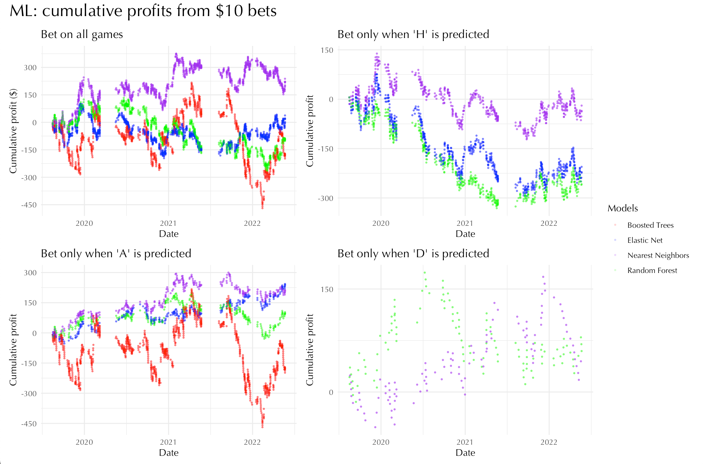

# Soccer betting simulation project

- Ran a simulation of soccer betting on over 8000 games.
- Assessed and compared three betting strategies: 1) arbitrage betting, 2) positive EV betting, 3) machine learning-based betting. 
- Trained machine learning model that outperformed both arbitrage and positive EV betting in the long run.
- Estimated profit of $792 per season achieved from $10 bets.

Access report.pdf or report.pptx (explanations included in speaker notes) for a more detailed summary.
